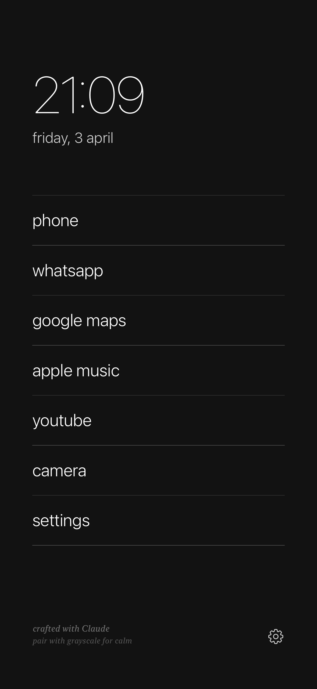
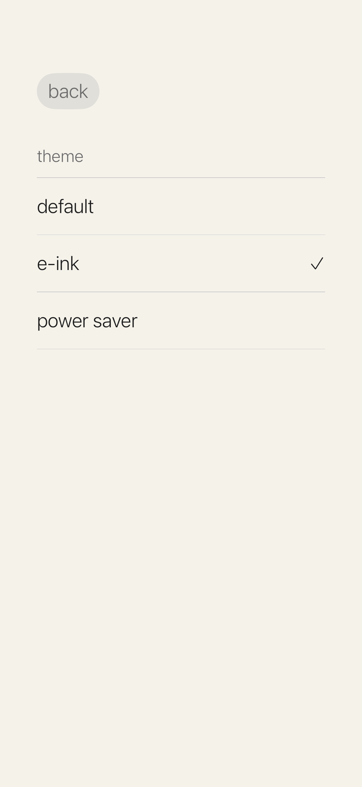
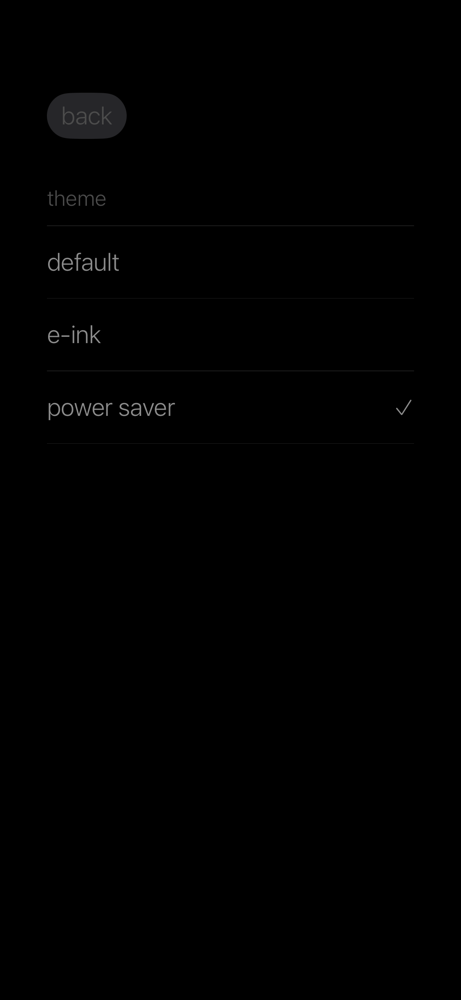

# essentials

A minimal, dumb phone launcher for iPhone. Built with SwiftUI.

Strip your phone back to what matters — no icons, no colors, no distractions. Just text, time, and the few apps you actually need.

## Screenshots

<p align="center">
  
  &nbsp;&nbsp;
  
  &nbsp;&nbsp;
  
</p>

## Features

### Launcher
- **Large clock** — 64pt ultralight, always visible
- **Date** — lowercase, minimal
- **App list** — tap a label, open the app. That's it.

### Apps
| Label | Action |
|-------|--------|
| phone | Built-in dialler + favourites with contact search |
| whatsapp | Opens WhatsApp |
| google maps | Opens Google Maps |
| apple music | Opens Apple Music |
| youtube | Opens YouTube |
| camera | Native camera — take a photo, saves to library, returns to launcher |
| settings | Opens iOS Settings |

### Phone (built-in)
- **Favourites tab** — add contacts from your address book, tap to call via WhatsApp
- **Dialler tab** — full numeric keypad, tap the green button to call
- **Contact search** — search your entire contact list, add to favourites

### Themes
Three themes, persisted across launches:
- **default** — dark (#121212), white text
- **e-ink** — warm paper background, dark text, muted green accents
- **power saver** — pure OLED black, dim text, minimal battery draw

Pair any theme with iOS **Settings → Accessibility → Display → Color Filters → Grayscale** for the full dumb phone experience.

### Camera
Opens the native iOS camera inline. Take a photo → auto-saves to your photo library → returns to the launcher. No gallery, no filters, no editing.

## Requirements

- iPhone running iOS 17+
- Xcode 15+
- Apple ID (free personal team works for sideloading)

## Setup

```bash
git clone https://github.com/myExperimentsWithTruth/essentials.git
cd essentials
open EssentialsApp.xcodeproj
```

1. In Xcode: **Signing & Capabilities** → select your Apple ID team
2. Connect your iPhone via USB
3. Select your iPhone as the build target
4. **Cmd + R** to build and run

### First launch on device
iOS will show "Untrusted Developer". Go to:
**Settings → General → VPN & Device Management → [your Apple ID] → Trust**

Then run again from Xcode.

> **Note:** Free Apple ID signing lasts 7 days. Re-run from Xcode to refresh. A paid Developer account ($99/year) makes it permanent.

## Project Structure

```
EssentialsApp/
├── EssentialsApp.xcodeproj/
├── Essentials/
│   ├── EssentialsApp.swift        # App entry point + ThemeManager injection
│   ├── ContentView.swift          # All views in a single file:
│   │   ├── ThemeManager           #   Observable theme system
│   │   ├── ContentView            #   Main launcher (clock + app list)
│   │   ├── SettingsView           #   Theme picker
│   │   ├── PhoneView              #   Phone tabs (favourites / dialler)
│   │   ├── FavouritesView         #   Favourite contacts list
│   │   ├── ContactListView        #   Full contact search + add
│   │   ├── DialerView             #   Numeric keypad + call button
│   │   └── CameraView             #   UIImagePickerController wrapper
│   ├── Info.plist                 # Permissions + URL scheme queries
│   └── Assets.xcassets/           # App icon (dark square, white dot)
```

## Permissions

| Permission | Why |
|------------|-----|
| Contacts | To search and call contacts from the phone view |
| Camera | To take photos from the camera launcher item |
| Photo Library (add) | To save captured photos |

## Philosophy

Your phone is a tool, not a slot machine. This launcher gives you:
- **Intentional friction** — no app grid to mindlessly browse
- **Time awareness** — the clock is the hero, not notifications
- **Minimal stimulation** — monochrome, no badges, no icons

---

*crafted with [Claude](https://claude.ai)*
